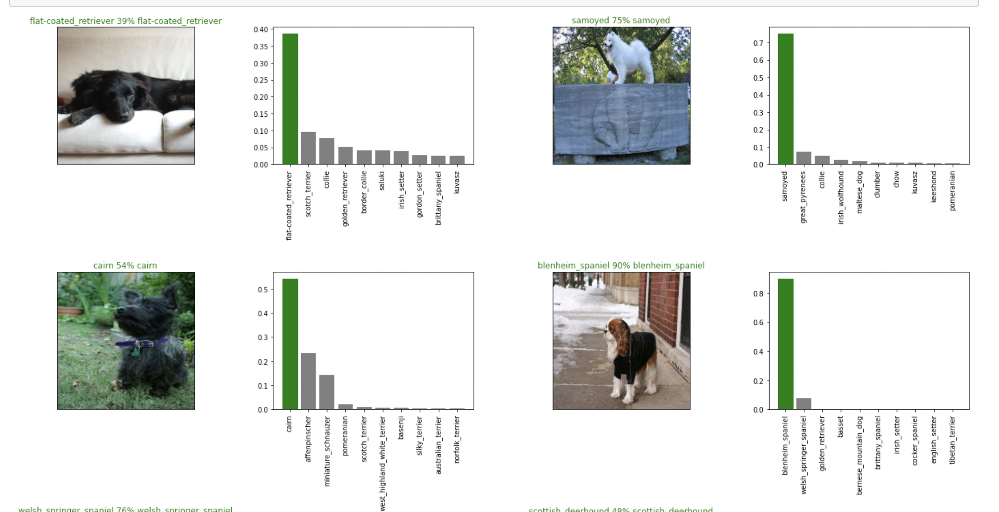
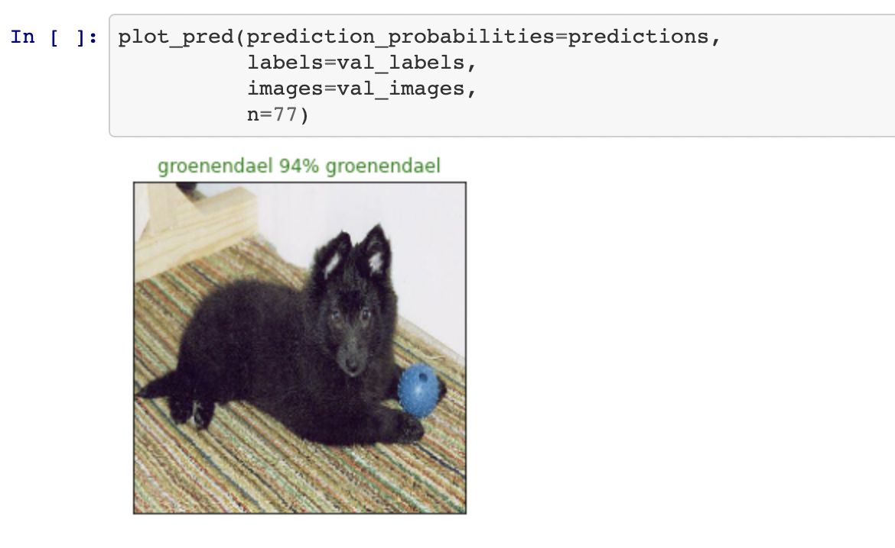
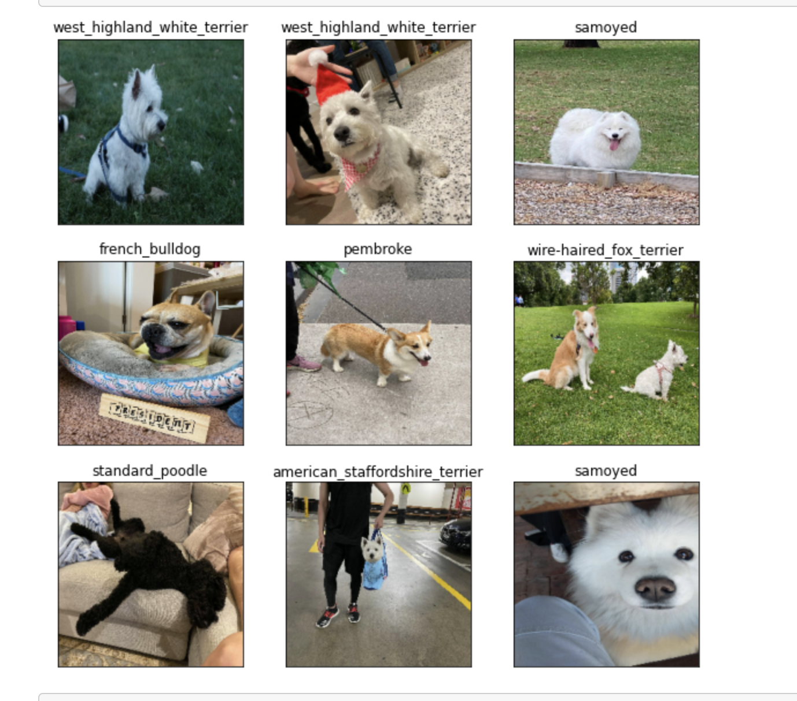

# dog-vision
An ML Project that trains on a dataset of dog images to create a model that can predict the breed of a dog

This notebook builds an end-to-end multi-class image classifier using TensorFlow 2.0 and TensorFlow Hub. This project was completed on a former Kaggle competition.

## 1. Problem
Identifying the breed of a dog given an image. Being able to identify a breed of a dog simply from an image.

## 2. Data
The data we're using is from Kaggle's dog breed identification competition

https://www.kaggle.com/c/dog-breed-identification/data

## 3. Evaluation
The evaluation is a file with prediction probabilities for each dog breed of each test image.

https://www.kaggle.com/c/dog-breed-identification/overview/evaluation

## 4. Features
Unstructured dog images - 120 Classess of dogs

We're dealing with images (unstructured data) - we will use deep learning/ transfer learning
There are 120 breeds of dogs which means there are 120 different classes.
There is roughly 10,000+ images in the training set which are labelled
There are around 10,000+ images in the test set (these images have no labels and are yet to be predicted)

## 5. Process
The following process was used to obtain the appropriate model:

* Getting data ready by transforming into tensors
* Creating a validation set
* Preprocessing images (turning these images into Tensors)
* Turning data into batches
* Visualising data batches
* Building the model
* Creating callbacks
* Training the model (on a subset of data)
* Making and evaluating predictions using a trained model
* Training the model (on the full data)
* Making predictions on the test dataset
* Making predictions on some custom images

### Screenshots
Example predictions on a subset of data including other possible predictions:

Example prediction on a single image:

Example predictions on a custom images (friend's dogs):

This project was created in accordance with zero-to-mastery's Data Science and Machine Learning Bootcamp 2021 and guided by [Daniel Bourke](https://www.mrdbourke.com/)
